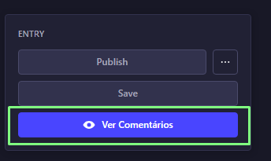
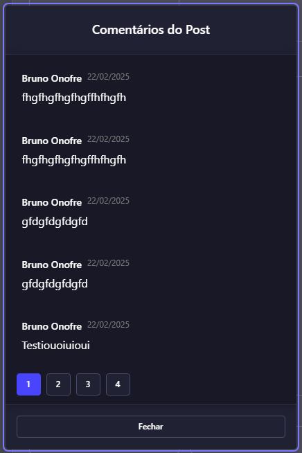

# Projeto Strapi Comments Plugin

Este projeto consiste em uma API criada com Strapi v5 e um plugin personalizado para exibir comentários relacionados a posts no painel administrativo.

## Versionamento

- Node.js versão 22.12.0
- Strapi v5

## Como Rodar o Projeto

1. Clone o repositório.
2. Execute `npm install` para instalar as dependências.
3. Inicie o projeto com `npm run develop`.

## Estrutura do Projeto

### Botão Ver Comentários

### Modal de Comentários

- **Post**: Representa um post criado por um autor.
- **Comment**: Representa um comentário feito em um post.
- Relacionamento: Um post possui vários comentários.

## Funcionalidades do Plugin

- Ao editar um post, os comentários são exibidos em uma modal com lista paginada.
- Paginação numérica com limite de 5 comentários por página.

## Endpoints da API

- **GET** `/api/post-comments/comments`: Retorna os comentários relacionados a um post. Parâmetros: `postId` (obrigatório), `page`, `pageSize`.

## Referências

- [Strapi Plugins Admin Panel API](https://docs.strapi.io/dev-docs/plugins/admin-panel-api)
- [Strapi Plugins Content Manager APIs](https://docs.strapi.io/dev-docs/plugins/content-manager-apis)
- [Strapi API Rest](https://docs.strapi.io/dev-docs/api/rest)

## Observações
- Algumas funcionalidades na documentação foram descotinuadas na versao 5 do Strapi, então tive que usar a solução alternativa que estava na documentação

- No teste foi pedido LESS CODE, então, aproveitei a estreutura inicial que o SDK cria, tanto do projeto, quanto dos plugins, com poucas alterações

- Toda a API e Entidades foram criadas pelo painel admin
