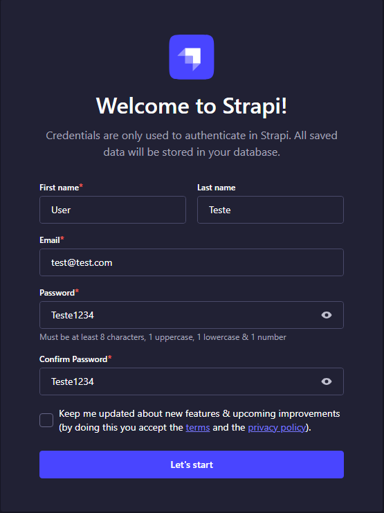
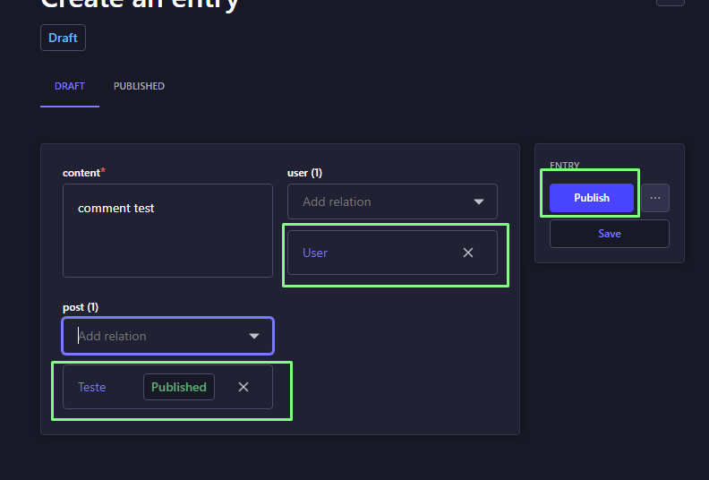

# Projeto Strapi Comments Plugin

Este projeto consiste em uma API criada com Strapi v5 e um plugin personalizado para exibir comentários relacionados a posts no painel administrativo.

## Versionamento

- Node.js versão 22.12.0
- Strapi v5

## Como Rodar o Projeto

1. Clone o repositório.
2. Execute `npm install` para instalar as dependências. O processo de instalação já realiza automaticamente a build do plugin.
3. Inicie o projeto com `npm run develop`.

## Testando
1. Ao navegar até a url do painel-admin, complete o formulário para criar um admin-user

2. Após criar o usuario admin, navegue pela sidebar até a aba **Content Manager**, clique em `Post`, e crie um registro.

3. Complete o formulário, adicione as relacoes e clique em publicar

4. Faça o mesmo com a **Collection Type** 'Comment'

5. Volte em Post, selecione o post criado, e na tela de edit, agora, aparecerá o botão do plugin, que abre a listagem de comentarios relacionados ao post.

## Estrutura do Projeto

### Botão Ver Comentários

### Modal de Comentários

- **Post**: Representa um post criado por um autor.
- **Comment**: Representa um comentário feito em um post.
- Relacionamento: Um post possui vários comentários.

## Funcionalidades do Plugin

- Ao editar um post, os comentários são exibidos em uma modal com lista paginada.
- Paginação numérica com limite de 5 comentários por página.
- Apenas os comentários publicados são exibidos, ignorando rascunhos.

## Endpoints da API

- **GET** `/api/post-comments/comments`: Retorna os comentários relacionados a um post.  
  - **Parâmetros:**  
    - `postId` (obrigatório): Identificador do post.
    - `page` (opcional): Página atual da listagem. Padrão: 1.
    - `pageSize` (opcional): Quantidade de comentários por página. Padrão: 5.
  - **Filtro:** Somente comentários com o campo `publishedAt` preenchido são retornados.

## Referências

- [Strapi Plugins Admin Panel API](https://docs.strapi.io/dev-docs/plugins/admin-panel-api)
- [Strapi Plugins Content Manager APIs](https://docs.strapi.io/dev-docs/plugins/content-manager-apis)
- [Strapi API Rest](https://docs.strapi.io/dev-docs/api/rest)
- [Strapi Design System](https://design-system.strapi.io/)

## Observações
- Algumas funcionalidades na documentação foram descontinuadas na versão 5 do Strapi, então utilizei soluções alternativas conforme a documentação oficial.
- No teste foi solicitado **LESS CODE**, então utilizei a estrutura inicial gerada pelo SDK do Strapi, com o mínimo de alterações necessárias.
- Todas as APIs e entidades foram criadas pelo painel admin do Strapi.
- O filtro de comentários agora exibe apenas os registros publicados (`publishedAt` != null), evitando duplicidades causadas por rascunhos.
- O script de build do plugin é executado automaticamente após o comando `npm install`, não sendo necessário rodar manualmente.
